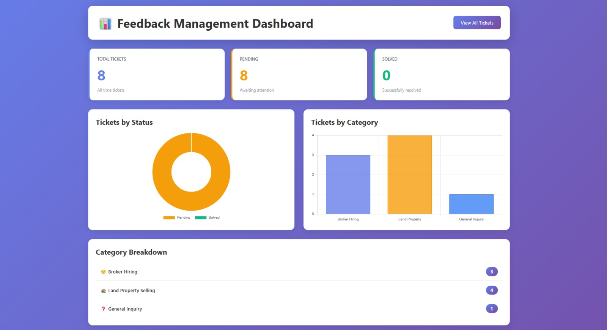
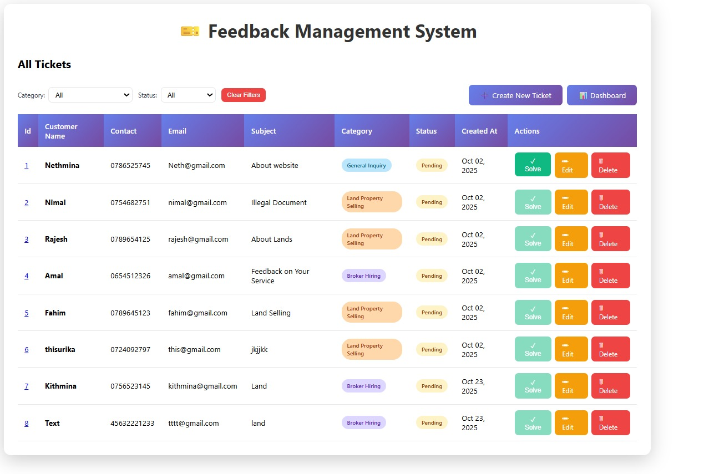
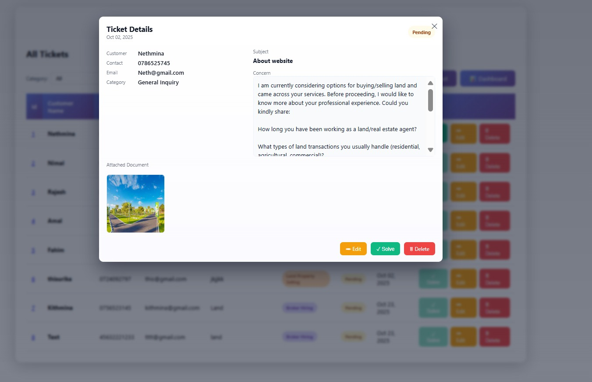
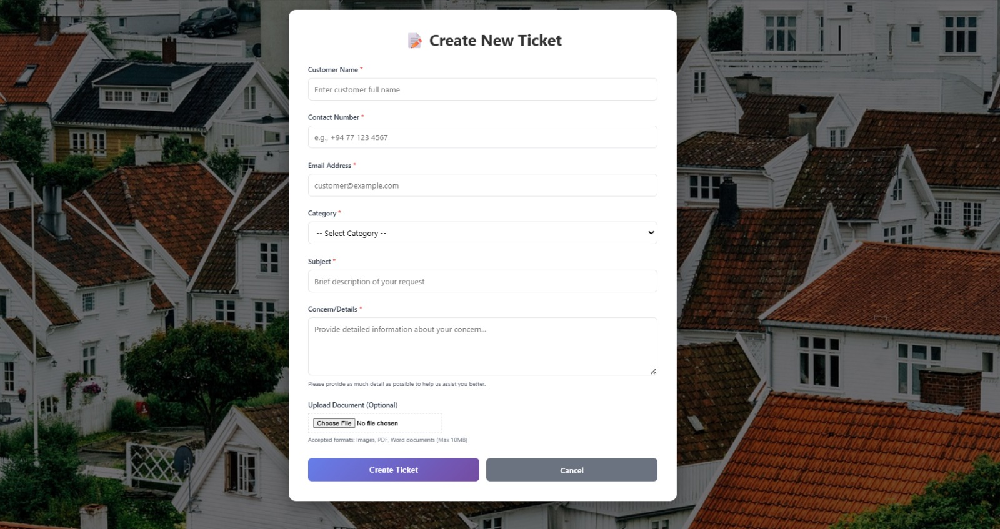

# Feedback-Management-System
A Feedback Management System collects, organizes, and analyzes user feedback to improve services or products. It allows users to submit comments or complaints online, and helps administrators track issues, generate reports, and make informed decisions for continuous improvement.

---

## 🚀 Features

- Submit new support tickets  
- View all tickets in the system  
- Check ticket details  
- Upload attachments  
- Dashboard with ticket statistics  
- Update ticket status (Pending / In Progress / Resolved)

---

## 🖼️ Screenshots

### **1. Dashboard**

### **2. All Tickets Panel**

### **3. Ticket Details**

### **4. Create Ticket Screen**

---

## 🛠️ Technologies Used

- Java 17  
- Spring Boot  
- Spring MVC  
- Spring Data JPA  
- H2 / MySQL  
- Maven  
- HTML / JSP / Thymeleaf  

---

## ⚙️ How to Run

1. Install JDK 17+ and Maven  
2. Open project in IntelliJ or VS Code  
3. Configure DB in:

